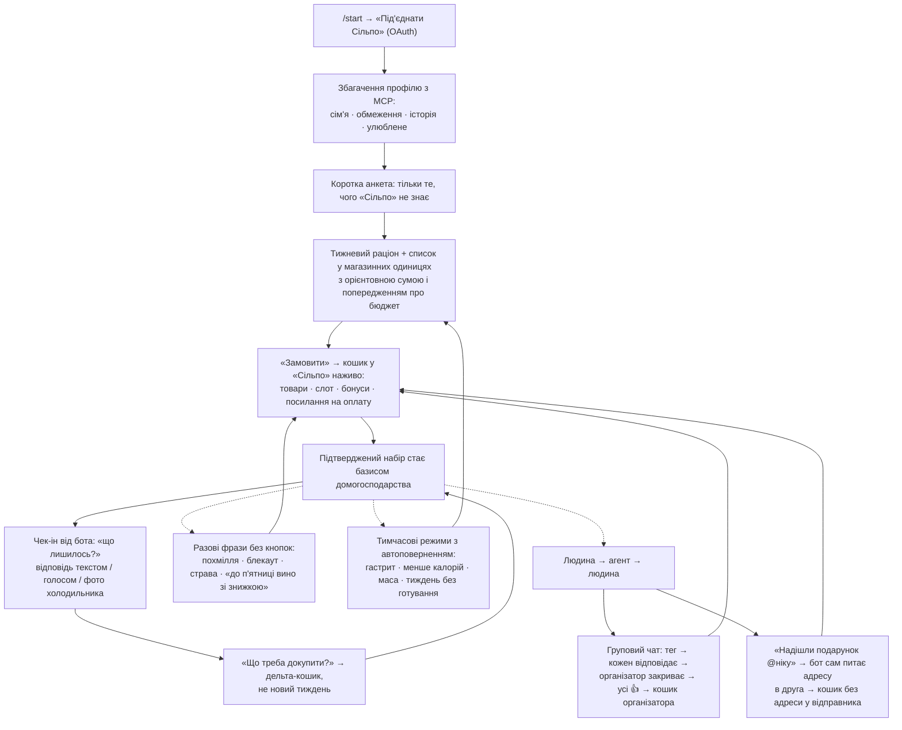
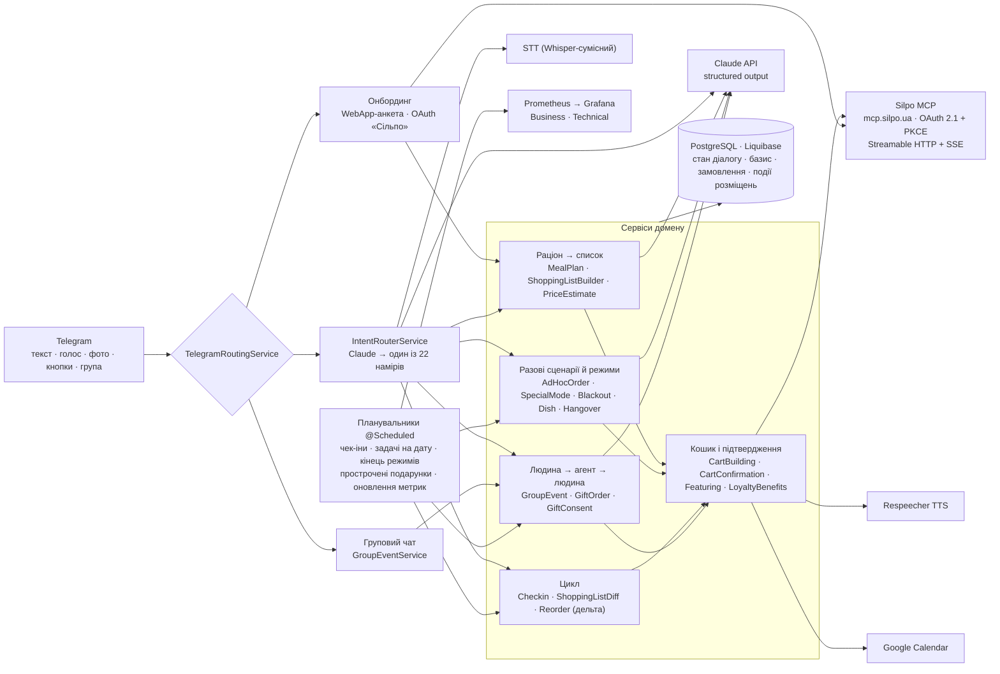

# Комора · «Смузі Геннадійович»

**Комора — це агент формату *food as a service*: він бере на себе побутове постачання їжею так, як
OpenClaw чи Hermes беруть на себе робочі задачі.** Гість один раз задає правила — склад сім'ї, обмеження,
бюджет, — а далі агент сам тримає баланс «потрібно / вже є»: складає тижневий раціон, збирає **справжній
кошик у «Сільпо»** через офіційний MCP-сервер, підбирає доставку, сам питає, що закінчилось, і сам збирає
дозамовлення. Це не порадник, що купити, а виконавець, який купує — з пам'яттю, що переживає рестарт, і
реальною послідовністю викликів до «Сільпо» за кожною дією.

У Telegram агент живе як бот **«Смузі Геннадійович»** — молодший брат Машрума Геннадійовича, який не лише
радить, а й замовляє. Той самий рушій, що збирає тижневий кошик, закриває й разові ситуації життя: похмілля,
блекаут, хвороба, тиждень без часу на готування, спільна закупка на компанію, подарунок другові за ніком.

Для «Сільпо» в тому самому рушії закладена модель заробітку: коли гість сам називає категорію, пріоритет у
ній отримує або **власна марка з високою маржею**, або **платне розміщення партнера** — і це вимірюється
часткою категорії у підтверджених замовленнях, а не показами. Нічого не нав'язується: обмеження й алергії
завжди сильніші за будь-яке розміщення.

Розроблено для хакатону [«Сільпо» AI Factory](https://ai-factory.silpo.ua).

---

## Зміст

1. [BYOK: підняти може будь-хто](#byok-підняти-може-будь-хто)
2. [Відповідь на шість пунктів завдання](#відповідь-на-шість-пунктів-завдання)
3. [MCP-матриця: усі 40 інструментів «Сільпо»](#mcp-матриця-усі-40-інструментів-сільпо)
4. [Як поводиться гість: user flow](#як-поводиться-гість-user-flow)
5. [Перелік можливостей](#перелік-можливостей)
6. [Архітектура](#архітектура)
7. [Запуск](#запуск)
8. [Ліцензія і відкритість](#ліцензія-і-відкритість)

---

## BYOK: підняти може будь-хто

Комора не має спільного хостингу, і репозиторій ні на який наш сервер не посилається. Модель —
**BYOK (Bring Your Own Key):** хто розгортає, той підставляє власні ключі й платить за власні виклики.

| Ключ | Навіщо | Обов'язковий |
|---|---|---|
| Telegram-бот (`TELEGRAM_BOT_TOKEN`) | канал спілкування з гостем | так |
| OAuth-клієнт «Сільпо» (`SILPO_MCP_CLIENT_ID`) | доступ до `https://mcp.silpo.ua/mcp` від імені гостя | так |
| Anthropic API (`ANTHROPIC_API_KEY`) | раціон, розбір вільного тексту, класифікація намірів | так |
| OpenAI-сумісний STT (`STT_API_KEY`) | голосові повідомлення від гостя | ні — без ключа бот попросить написати текстом |
| Respeecher (`RESPEECHER_API_KEY`) | голосові відповіді бота (`/voice`) | ні |
| Google OAuth | доставки в календарі гостя | ні |
| Grafana Cloud | ті самі дашборди, що й локально, тільки в хмарі | ні |

Кожне твердження нижче відтворюється локально, без жодного нашого акаунта:

| Що | Де | Як подивитись |
|---|---|---|
| Знімок реальних MCP-викликів і розподілу намірів | [`src/main/resources/static/pitch.html`](src/main/resources/static/pitch.html) | видно в репозиторії; піднятий застосунок віддає його за `/pitch.html` |
| Обидва Grafana-дашборди | [`observability/grafana/`](observability/grafana/) | `make observability-local-up` — одноразові Prometheus + Grafana |
| Повний прохід руками: бот, база, чекаут | [`docs/RUNBOOK.md`](docs/RUNBOOK.md) | що написати боту, що очікувати у відповідь, як перевірити в базі |
| Розгортання на власному домені | [`docs/RUNBOOK.md`](docs/RUNBOOK.md) §19–20 | compose + Caddy + Watchtower; один env-файл |
| Продуктовий контекст | [`docs/PRODUCT_BRIEF.md`](docs/PRODUCT_BRIEF.md) | для кого, яка проблема, сценарії |

---

## Відповідь на шість пунктів завдання

Формулювання — дослівно з [ai-factory.silpo.ua](https://ai-factory.silpo.ua/#requirements). Остання колонка —
місце в коді, яке можна відкрити.

| # | Вимога | Наша відповідь | Де в коді |
|---|---|---|---|
| 01 | Рішення обов'язково використовує офіційний MCP «Сільпо» | Кожна дія агента — від збагачення профілю на онбордингу до адреси, слота й посилання на оплату — проходить через MCP-сервер «Сільпо» з OAuth 2.1 + PKCE. Код тягне 27 із 40 інструментів; для кожного з 40 нижче написано, де він працює або чому свідомо не використаний | [`client/mcp/`](src/main/java/com/silporestockai/client/mcp/), [MCP-матриця](#mcp-матриця-усі-40-інструментів-сільпо) |
| 02 | AI-агент не лише генерує текст, а використовує tools для виконання завдання | Кошик — це ланцюг викликів: очистити кошик → перевірити слоти → знайти кожну позицію одним батчем → додати → перечитати суми → адреса й слот → чекаут. П'ять планувальників діють без запиту людини: чек-іни, разові задачі на дату, закінчення спецрежимів, прострочені запити на подарунок, оновлення метрик | [`CartBuildingService`](src/main/java/com/silporestockai/service/CartBuildingService.java), [`job/`](src/main/java/com/silporestockai/job/) |
| 03 | Чітко визначено, для кого створене рішення і яку проблему воно вирішує | Люди, чия година коштує дорожче за час на закупівлю: їжа вдома або закінчується не вчасно, або псується, бо ніхто не тримає баланс «потрібно / вже є». Цінність — час і когнітивне навантаження, не економія | [`docs/PRODUCT_BRIEF.md`](docs/PRODUCT_BRIEF.md) |
| 04 | Є working demo, інтерактивний прототип або переконлива демонстрація | Робочий Telegram-бот проти живого «Сільпо»: справжній кошик, справжній слот, справжнє посилання на оплату. Ранбук проводить сторонню людину тим самим шляхом крок за кроком | [`docs/RUNBOOK.md`](docs/RUNBOOK.md), [`controller/telegram/`](src/main/java/com/silporestockai/controller/telegram/) |
| 05 | Показано, де саме може працювати рішення | Три канали: всередині продукту «Сільпо», як зовнішній сервіс (Telegram — лише один фронтенд), як окремий підписний продукт. Уся логіка живе за роутером намірів, а не за кнопками Telegram, тому заміна каналу не торкається бізнес-логіки. Два вбудовані канали зростання — спільна закупка в груповому чаті й подарунок за ніком — приводять нових гостей без реклами | [`IntentRouterService`](src/main/java/com/silporestockai/service/IntentRouterService.java) |
| 06 | Є пояснення, як перевірити корисність — тестування, метрики, експеримент, економічний ефект | Метрики знімаються з бази, не з відчуттів: час від фрази до підтвердженого замовлення (медіана за кожним наміром), частка позицій списку, що стали реальним SKU, дозамовлення без правок, GMV, Attributed Revenue і Featured Share Rate окремо за пулом власних марок і платних партнерів, кількість людей, яких привели групові збори й подарунки. Два дашборди генеруються з коду й перевіряються тестом | [`ObservabilityService`](src/main/java/com/silporestockai/service/ObservabilityService.java), [`observability/grafana/`](observability/grafana/) |

---

## MCP-матриця: усі 40 інструментів «Сільпо»

Сервер `mcp.silpo.ua` віддає 40 інструментів. Нижче — кожен із них: що він робить в агенті, або чому агент
його свідомо не викликає. Живий знімок частот і помилок із реального прогону — на
[`pitch.html`](src/main/resources/static/pitch.html); тут — призначення.

### Кошик і замовлення

| Інструмент | Роль в агенті |
|---|---|
| `silpo_find_products_batch` | Основний пошук: кожен рядок списку йде в каталог одним батчем. Ним же добираються готові страви, інгредієнти страви, товари для похмілля чи блекауту і кандидати для розміщень |
| `silpo_create_shopping_cart` | Кошик під конкретне замовлення; в акаунта «Сільпо» кошик один, тому виклик ідемпотентний |
| `silpo_get_my_shopping_cart` | Поточний кошик домогосподарства — з нього починається будь-яка збірка |
| `silpo_get_shopping_cart_by_id` | Перечитати кошик після змін: суми, знижки й підсумок є лише тут, не у відповіді на додавання |
| `silpo_clear_shopping_cart` | Очистити перед кожною новою збіркою, щоб замовлення не успадкувало вчорашнє |
| `silpo_add_or_update_cart_products` | Додати позиції та змінити кількості — у першому кошику, дозамовленні, доборі до мінімуму доставки |
| `silpo_remove_cart_products` | Прибрати позицію, яку гість викреслив зі списку |
| `silpo_update_shopping_cart` | Адреса, тип доставки і слот проставляються в кошик до генерації посилання на оплату; для подарунка — адреса отримувача |
| `silpo_get_replacements` | Чим замінити позицію, якої немає в наявності, під час дозамовлення |

### Доставка

| Інструмент | Роль в агенті |
|---|---|
| `silpo_get_time_slots` | Вільні вікна доставки: перший підбір, «Інший час», автопідбір, коли попередній слот прострочився, і вікно 10:00–22:00 для кошика з готовою їжею |
| `silpo_get_available_delivery_types` | Які способи доставки доступні цьому кошику |
| `silpo_get_my_delivery_addresses` | Збережені адреси гостя |
| `silpo_find_address` | Адреса словами → координати; так адреса отримувача подарунка стає філією і слотом, а відправник її не бачить |
| `silpo_list_branches` | Магазин самовивозу, коли кур'єрська доставка не підходить |

### Профіль гостя та історія

| Інструмент | Роль в агенті |
|---|---|
| `silpo_get_my_family` | Склад домогосподарства з профілю «Сільпо» — щоб не питати те, що вже відоме |
| `silpo_get_my_food_restrictions` | Харчові обмеження з профілю — основа фільтра на весь підбір |
| `silpo_get_my_favorites` | Улюблені товари як стартовий базис раціону |
| `silpo_get_my_online_orders` | Минулі онлайн-покупки: базис на онбордингу, «зроби список як минулого разу», «де моє замовлення?» |
| `silpo_get_my_offline_orders` | Покупки в магазині, коли онлайн-історії ще немає |

### Бонуси, сертифікати, промо

| Інструмент | Роль в агенті |
|---|---|
| `silpo_get_loyalty_info` | Баланс бонусів і скільки з них можна списати на цей кошик |
| `silpo_get_my_certificates` | Подарункові сертифікати домогосподарства |
| `silpo_add_or_update_certificates` | Сертифікат застосовується до кошика автоматично — єдина дія з бонусного блоку, яку API дозволяє |
| `silpo_get_promo_codes` | Промокоди, які кошик може прийняти |
| `silpo_get_my_promos` | Персональні промо-пропозиції гостя |
| `silpo_get_my_coupons` | Купони гостя — показуються, бо застосувати їх може лише застосунок «Сільпо» |
| `silpo_get_coupon_details` | Умови конкретного купона, щоб не обіцяти знижку, якої не буде |
| `silpo_get_my_premium_subscription` | Статус підписки — інформаційно, керувати нею через API не можна |

### Не використовуються — і чому

| Інструмент | Чому агент його не викликає |
|---|---|
| `silpo_get_promotions` | Викликався в ранніх версіях; повертає коди кампаній, а не товари. Знижки агент бере з цін у кошику й промокодів |
| `silpo_get_products`, `silpo_get_product_details`, `silpo_get_similar_products`, `silpo_get_product_sets` | Батч-пошук повертає все, що потрібно кошику: назву, ціну, наявність, ідентифікатор. Окремі картки товару не потрібні жодному сценарію |
| `silpo_get_categories`, `silpo_get_categories_tree`, `silpo_get_category`, `silpo_get_popular_categories` | Список резольвиться за назвами позицій, а не через навігацію по дереву категорій |
| `silpo_get_my_profile` | Потрібні поля профілю (сім'я, обмеження, улюблене) дають три вужчі інструменти вище |
| `silpo_add_or_update_favorite_products` | Агент не пише в улюблене гостя без його прохання |
| `silpo_find_nova_poshta_settlements`, `silpo_find_nova_poshta_offices` | Подарунок їде кур'єром на адресу отримувача; жоден інструмент не дозволяє назвати іншу людину одержувачем, тому відділення не мають сенсу |

---

## Як поводиться гість: user flow

Гість спілкується з ботом так, як писав би людині-помічнику: текстом, голосом або фото. Кнопок — п'ять,
усе інше — вільна фраза. Агент сам ініціює контакт, коли настає час.



Що в цьому важливо:

- **Один вхід для всього.** Будь-яка фраза — текстова чи голосова — потрапляє в роутер намірів і далі в той
  сервіс, який уже володіє цією можливістю. Нова можливість — новий обробник, а не нова кнопка.
- **Агент ініціює, а не чекає.** Чек-іни, разові задачі на дату, закінчення спецрежимів і прострочені
  запити на подарунок запускають планувальники; гість дізнається результат у чаті.
- **Підтвердження завжди за людиною.** Агент збирає й показує кошик з реальними цінами; оплату гість
  завершує сам за посиланням «Сільпо». Спільна закупка не рухається, поки не погодились усі, хто відповів.
- **Стан живе в базі, не в пам'яті процесу.** Кожен апдейт Telegram — незалежний запит; профіль, базис,
  список, замовлення й крок діалогу переживають рестарт і масштабування на кілька інстансів.

---

## Перелік можливостей

| Область | Можливість | Як вмикається |
|---|---|---|
| Онбординг | OAuth «Сільпо» одним натисканням; збагачення профілю з MCP; коротка WebApp-анкета лише про невідоме | `/start` |
| Онбординг | Одноразова підказка про можливості після першого плану; пропозиція під'єднати календар | автоматично |
| Раціон | Тижневий раціон під склад сім'ї, обмеження та звичку готувати; «що їмо в середу?» | після анкети; фраза |
| Список | Список у магазинних одиницях з орієнтовною сумою до кошика і попередженням, якщо дорожче за бюджет | автоматично |
| Список | Список із фото холодильника, фото чека або одного речення; «прибери молоко, додай яйця» | фото / фраза |
| Список | «Зроби список як минулого разу» — з реальних замовлень «Сільпо» | фраза |
| Кошик | Збірка кошика в «Сільпо» через MCP: пошук батчем, чесне «не знайшов», добір до мінімуму доставки з власного набору | кнопка «Замовити» |
| Кошик | Слот доставки людською мовою, «Інший час», автопідбір прострочених слотів, вікно для готової їжі | автоматично |
| Кошик | Бонуси, сертифікати (застосовуються самі), промокоди, купони й персональні промо в одному блоці | автоматично; «які в мене бонуси?» |
| Кошик | Посилання на оплату «Сільпо»; «де моє замовлення?» | після підтвердження; фраза |
| Цикл | Чек-ін від бота раз на кілька днів; відповідь текстом, голосом або фото | планувальник |
| Цикл | Дозамовлення дельтою: додано / прибрано / разом / економія за акціями; заміни для відсутніх позицій | «що треба докупити?» |
| Цикл | Товари, які ніколи не з'їдають, випадають із наступного плану | автоматично |
| Разові | «Голова після вчорашнього» — регідратація, сорбенти, найближчий слот | фраза / голос |
| Разові | «Світло вимкнули» — їжа без плити й холодильника | фраза |
| Разові | «Замов усе для карбонари» — інгредієнти на одну страву, з тексту або фото страви | фраза / фото з підписом |
| Разові | «Замов до п'ятниці вино та сир зі знижкою» — задача на дату; кнопка «Заплановані» для правок | фраза |
| Режими | Гастрит (щадний → дієт-стіл № 5 → звичайний), менше калорій, набір маси, тиждень готової їжі — усі з датою автоповернення, профіль не чіпають | фраза |
| Режими | «Тільки український виробник» — фільтр на всі наступні пошуки з чесним «аналога немає» | фраза |
| Компанія | Спільна закупка в груповому чаті: реплаї, організатор закриває список, консенсус 👍, кошик організатора | тег бота в групі |
| Подарунок | Подарунок другові за ніком; бот сам питає адресу в отримувача, відправник її не бачить | фраза |
| Голос | Голосові повідомлення від гостя в будь-якому сценарії; голосові відповіді бота за бажанням | автоматично; `/voice` |
| Календар | Доставка як подія в Google Calendar | «підключи календар» |
| Для «Сільпо» | Два пули розміщень — власні марки й платні партнери — з подіями показ → кошик → замовлення і Featured Share Rate за категорією | адмін-ендпоінт |
| Для «Сільпо» | Business- і Technical-дашборди: намір → замовлення, GMV, Attributed Revenue за пулом, соціальні канали, RED-метрики по кожному MCP-інструменту | Grafana |
| Зворотний зв'язок | Кнопка «Фідбек» | кнопка |

---

## Архітектура



### Маршрутизація, яку легко розширювати

Уся поведінка агента стоїть за одним роутером намірів. Вільна фраза (або транскрипт голосового) іде в Claude
зі структурованою схемою відповіді й повертається як один із 22 намірів із оцінкою впевненості; нижче порога
бот ставить уточнювальне питання замість того, щоб вгадувати. Роутер не містить бізнес-логіки — він лише
диспетчер до сервісу, який уже володіє можливістю. Тому додати новий сценарій означає: одна константа в
переліку намірів, кілька рядків у системному промпті і сервіс-обробник. Кнопки Telegram лишаються тонким
шаром поверх цього, а не альтернативним шляхом.

Чотири примітиви, з яких складено кожну можливість:

1. **Список їжі** — раціон → список → кошик → базис → дельта.
2. **Задача на час** — разове замовлення на дату, чек-ін, закінчення режиму.
3. **Тимчасовий режим з автоповерненням** — гастрит, менше калорій, маса, тиждень без готування, блекаут.
4. **Людина → агент → людина** — груповий збір і подарунок за ніком.

### Домовленості, що тримають межі

- **Liquibase володіє схемою**; `ddl-auto: validate` — сутність без changeset'а ламає кожен інтеграційний тест.
- **ArchUnit** перевіряє, що `Service` досяжний лише з `Controller` і `Job`, що SDK Telegram не витікає за
  межі `controller.telegram` / `service.telegram`, і що впровадження лише через конструктор.
- **Стан діалогу — лише в базі.** Жоден flow-сервіс не тримає стану в полях: два апдейти Telegram можуть
  прийти на різні інстанси.
- **Груповий чат — ніколи не домогосподарство.** Раунд живе в `group_event`, бот реагує лише на реплаї на
  свої повідомлення та свої кнопки.
- **Оновлення токена «Сільпо» при 401 — наше**, не SDK: SDK повторює запит зі старим заголовком.

### Стек

| Шар | Технологія |
|---|---|
| Мова / фреймворк | Java 25, Spring Boot 4.1, Spring Cloud 2025.1 |
| LLM | Anthropic Java SDK, structured output; 19 системних промптів у [`src/main/resources/prompts/`](src/main/resources/prompts/) |
| MCP | офіційний MCP Java SDK, Streamable HTTP + SSE, власний OAuth 2.1 + PKCE і рефреш токена |
| Telegram | Bot API у режимі webhook (`telegrambots-client`), WebApp-анкета |
| Голос | OpenAI-сумісний STT (Whisper), Respeecher TTS |
| Дані | PostgreSQL, Liquibase, Spring Data JPA, MapStruct, Caffeine |
| Стійкість | OpenFeign + Resilience4j для звичайних HTTP-інтеграцій |
| Спостережуваність | Micrometer → Prometheus; Grafana-дашборди генеруються скриптом і перевіряються тестом; Alloy для Grafana Cloud |
| Тести | JUnit 5, Testcontainers (PostgreSQL), ArchUnit, Spotless |
| Розгортання | Docker Compose, Caddy (TLS автоматично), GHCR + Watchtower (деплой із `main`) |

---

## Запуск

### Локально

Потрібні Docker і публічний HTTPS-тунель для webhook (наприклад, `ngrok http 8080`). JDK ставити не треба —
Gradle завантажує потрібну версію сам.

```bash
cp .env.example .env
# Заповнити щонайменше:
#   TELEGRAM_BOT_TOKEN, TELEGRAM_WEBHOOK_URL (https://<тунель>/telegram/webhook),
#   TELEGRAM_WEBHOOK_SECRET, SILPO_TOKEN_ENCRYPTION_KEY, ANTHROPIC_API_KEY

make run          # застосунок + Postgres із docker-compose
make dev          # те саме з одноразовою базою Testcontainers
make demo         # режим запису: тихий лог, кольорові рядки MCP/Claude
make test         # unit + інтеграційні тести (потрібен Docker)
make help         # усі команди
```

Перевірка: `curl localhost:8080/actuator/health` повертає `UP`, у лозі є `Registered the Telegram webhook`.
Далі — `/start` у чаті з ботом. Повний прохід із очікуваними відповідями та SQL-перевірками:
[`docs/RUNBOOK.md`](docs/RUNBOOK.md).

### Дашборди без хмари

```bash
make observability-local-up   # Prometheus + Grafana, обидва дашборди на localhost:3000
```

### На власному сервері

Потрібні домен з A-записом, сервер із Docker і бот від BotFather.

```bash
git clone git@github.com:javaAndScriptDeveloper/SilpoRestockAI.git komora && cd komora
cp .env.prod.example .env.prod && vim .env.prod   # DOMAIN + обов'язкові секрети
./scripts/deploy.sh                                # ідемпотентно: перший деплой і кожне оновлення
```

`deploy.sh` перевіряє конфігурацію, чекає healthcheck і звіряє публічний URL. Далі кожен merge у `main`
збирає образ у GHCR, а Watchtower на сервері його підхоплює. Деталі та відкат —
[`docs/RUNBOOK.md`](docs/RUNBOOK.md) §19–20.

---

## Ліцензія і відкритість

Код відкритий під **[Apache License 2.0](LICENSE)**: вільне використання, зміна й розповсюдження з явним
патентним грантом — умови, які дозволяють великій компанії брати код у власну екосистему без додаткових
погоджень. Разом із BYOK це означає, що будь-хто може взяти репозиторій, підставити свої ключі й запустити.

Ми будемо раді, якщо ця розробка або її ідеї — агент, що виконує замість того, щоб радити; роутер намірів
замість кнопок; вимірювані розміщення всередині кошика; спільна закупка й подарунок як канали зростання —
стануть частиною екосистеми «Сільпо» в будь-якій формі, яку компанія вважатиме доречною.
